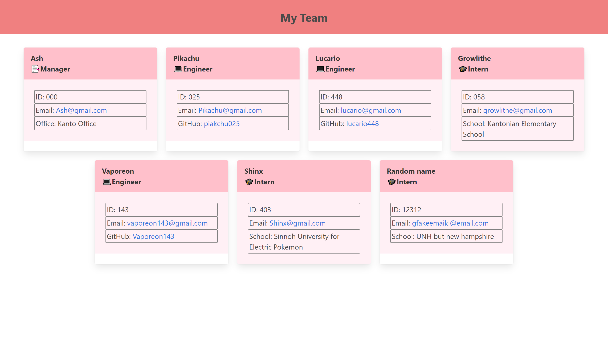

# Employee Card Generator

This project utilizes node.js, inquirer.js, and jest.js to create a command line tool that generates an HTML page with cards based on the user's input. The application will ask the user to enter information about a team manager and then ask for the user to either enter a new intern card or engineer card. This process repeats until the user decides to finish.

[Project Example Video](./assets/VideoExample.mp4)

## Table of Contents
* [Installation](#installation)
* [Test Examples](#test-examples)
* [Contributors](#contributors)
* [Questions](#questions)
* [License](#license)

# Installation
Download all the files. Ensure that the lib folder contains four items, Employee.js, Engineer.js, Intern.js, and Manager.js. There should also be an index.js and package.json in the root folder. You will also need to have node.js installed to your machine. From any command console (such as gitbash or terminal), move into the root folder's directory and run "npm install". After installing the necessary technologies, you can run "node index.js" to run the application. An HTML and CSS file found within a dist folder will be created upon completion.

# Test Examples
Download the test folder which should contain four *.test.js files. Run the tests by using any command console and run "npm run test" to activate.

# Contributors
Thanks to the following people who have contributed to this project:

* [Scott Byer](https://github.com/switch120) 
* [Mike Fearly](https://michaelfearnley.com/)
* UNH Full Stack Development Bootcamp

# Questions
You can find me at my [github page here](https://github.com/ejhuang2015).
Any comments, questions, or concerns? Email me  at ejhuang.2015@gmail.com.

# License
### Copyright (c) [2021] [ejhuang2015]
View the license in [license.txt](./license.txt)